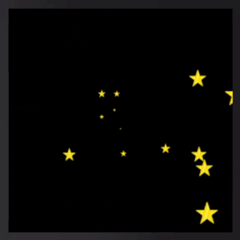

# Animation for Fitbit

This library allows you create complex animations in Fitbit apps and clockfaces.



### Installation

Install the library with `npm i fitbit-animate`

# Usage

Function `fitbit_animate` accepts sequence of animations in form of array where each element is an object with properties:

**elem**:     [G Container](https://dev.fitbit.com/build/guides/user-interface/svg/#g-container) containing GUI elements you want to animate

**prop**:     [groupTranform](https://dev.fitbit.com/build/guides/user-interface/animations/#javascript-animations) property, such as "translate" or "scale"

**subprop**:  actual propety you want to animate, such as x or y.  

**from**:     numeric value indicating animation start such as x or y coordinate or scale

**to**:       numeric value indicating animation end

**dur**:      duration of animation in milliseconds

Animation sequence can include multiple different GUI elements (G Containers) and each element can animate at different speed. Function returns a promise that resolves when all animation in the sequence are finished.

resources/index.gui
``` xml
    <g id="coolGroup">
        <circle r="5" fill="white" /> 
    </g> 
```
app/index.js
``` javascript
    import { fitbit_animate } from 'fitbit-animate';

    let element = document.getElementById('coolGroup');

    let sequence = [
        {
            elem: element,
            prop: "translate",
            subprop: "x",
            from: 50,
            to: 100,
            dur: 1000
        },
        {
            elem: element,
            prop: "translate",
            subprop: "y",
            from: 50,
            to: 100,
            dur: 1000
        },
        {
            elem: element,
            prop: "scale",
            subprop: "x",
            from: 1,
            to: 2,
            dur: 1000
        }
    ];

    fitbit_animate(sequence).then(()=>{
        console.log("Animation complete!")
    })

```
The above example will move circle from position (50, 50) to (100,100) while increasing its size twice, for the duration of 1 second.

# Demo

A demo (animated starfield) is available [here](https://github.com/ygalanter/fitbit-animate-demo)
